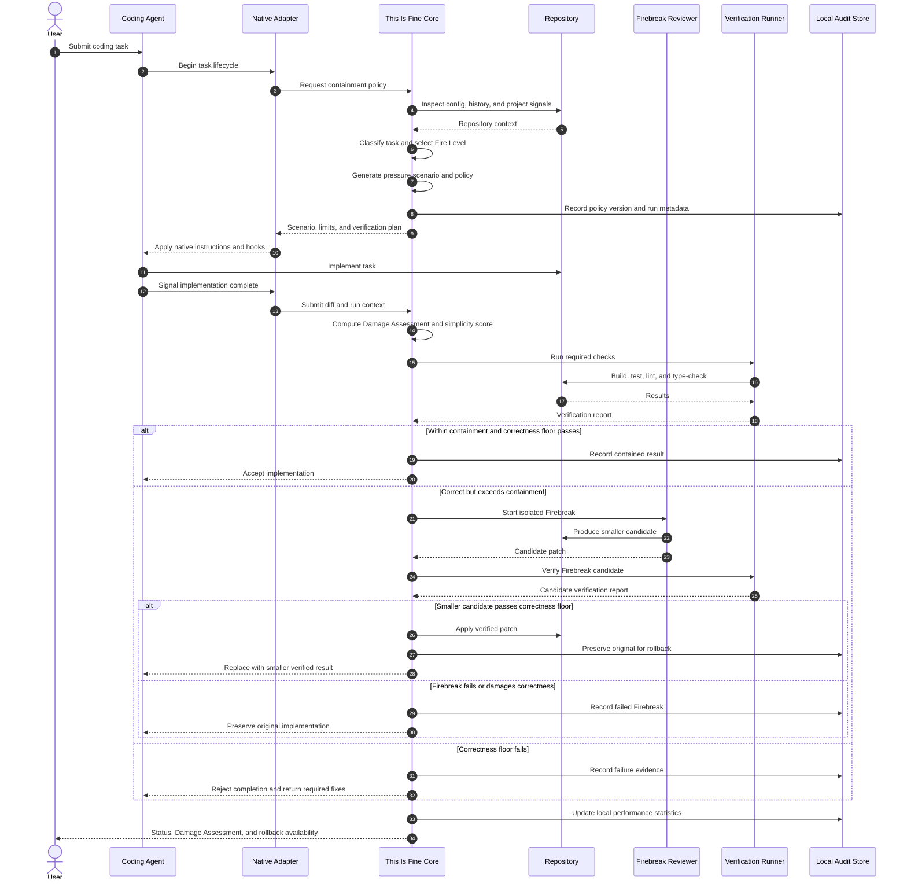
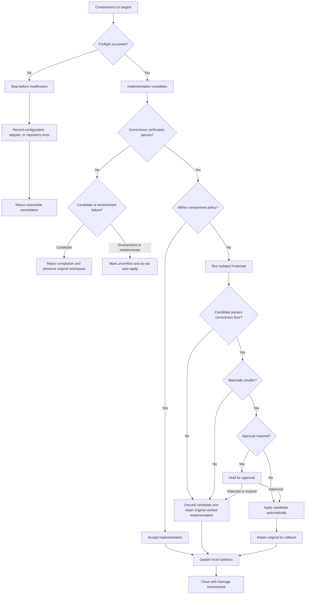

# This Is Fine — Product and System Design Specification

**Status:** Approved design baseline  
**Date:** 2026-08-04  
**Repository:** `9thLevelSoftware/this-is-fine`  
**Product type:** Local-first adaptive restraint and simplification system for coding agents

## 1. Executive Summary

**This Is Fine** is a cross-platform developer tool that reduces unnecessary code, files, dependencies, abstractions, prose, and agent token usage while preserving a strict correctness floor.

The product combines three mechanisms:

1. **Controlled pressure** — task-appropriate stress scenarios intended to influence model behavior toward urgency, restraint, reuse, and minimal diffs.
2. **Containment policy** — explicit, repository-aware rules governing what the implementation may add or change.
3. **Verification and Firebreak** — independent post-generation analysis that simplifies oversized implementations and accepts a smaller candidate only when it preserves required behavior, security boundaries, validation, and verification outcomes.

The core product promise is:

> **Contain the fire. Do not remodel the building.**

Stress prompting is treated as an experimentally useful behavioral nudge, not as a guaranteed inference mechanism. The dependable parts of the system are its repository inspection, measurable containment policies, isolated candidate generation, verification gates, rollback, and local adaptation.

## 2. Product Identity

### 2.1 Name

The product name is **This Is Fine**.

### 2.2 Positioning

> **This Is Fine is a repository-aware simplicity governor for coding agents. It applies controlled pressure, measurable containment policies, and verified simplification to produce the smallest correct implementation.**

### 2.3 Tone

The product should feel like serious production tooling with dry incident-response humor. The theme should reinforce system concepts rather than obscure them.

### 2.4 Visual identity boundary

The product must use original artwork and must not copy the dog, room, composition, or distinctive visual expression of the well-known “This Is Fine” comic. Suitable original motifs include:

- A terminal containing a small controlled flame
- A passing-test checkmark on a coffee mug amid alert indicators
- A fire extinguisher shaped like a closing brace
- A flame enclosed within a diff or terminal icon
- An original incident-response mascot unrelated to the comic character

### 2.5 Product vocabulary

| Technical concept | Product term |
|---|---|
| Stress-prompt context | Pressure Scenario |
| Anti-bloat rules | Containment Policy |
| Aggressiveness | Fire Level |
| Repository discovery | Source Inspection |
| Diff and policy report | Damage Assessment |
| Automatic simplification | Firebreak |
| Avoidable additions | Fuel Added |
| Successful result | Contained |
| Excessive result | Out of Control |
| Emergency recovery | Five-Alarm |

## 3. Goals and Non-Goals

### 3.1 Goals

The MVP must:

- Integrate with Claude Code, Codex, Gemini CLI, and OpenCode.
- Support Windows, macOS, and Linux.
- Deliver a Rust core as portable standalone binaries.
- Provide both a scriptable CLI and an interactive TUI.
- Apply repository-aware pressure scenarios and containment policies through native agent mechanisms where possible.
- Evaluate completed diffs against configurable simplicity rules.
- Run an independent Firebreak reviewer when a correct implementation exceeds containment limits.
- Preserve the original implementation until a smaller candidate passes the correctness floor.
- Learn locally which pressure variants, Fire Levels, and reviewer models work best.
- Keep repository history, prompts, adaptation data, and audit data local.
- Support read-only CI enforcement and optional patch or pull-request generation.

### 3.2 Non-goals for the MVP

The MVP will not:

- Operate as a universal transparent API proxy.
- Depend on a cloud service or account.
- Upload telemetry or shared learning data.
- Automatically authorize new hosted models.
- Replace repository-native test, build, lint, or type-check systems.
- Guarantee that emotional or urgent wording improves every model or task.
- Optimize for architectural expansion, speculative flexibility, or generalized frameworks.
- Modify protected branches directly from CI.
- Use arbitrary generated emergencies without controlled templates and evaluation.

## 4. Core Optimization Model

### 4.1 Primary objective

The primary objective is **maximum minimalism**.

The system should minimize, in repository-configurable order and weight:

- New runtime dependencies
- New files
- Added public interfaces
- New abstractions and indirection
- Added lines of code
- Configuration surface
- Generated code
- Duplication
- Unrelated modifications
- Agent narration and output tokens

### 4.2 Correctness floor

Minimalism is bounded by a non-negotiable correctness floor. A candidate is disqualified when it violates any required condition:

- The stated acceptance criteria are not satisfied.
- Existing required behavior regresses.
- Security boundaries are weakened.
- Required validation or error handling is removed.
- Required repository verification fails.
- Existing tests fail for reasons attributable to the candidate.
- New tests needed to prove changed behavior are absent.

The correctness floor is a gate, not a weighted score. A smaller incorrect candidate can never defeat a larger correct candidate.

### 4.3 Test modification policy

Firebreak may modify tests only under strict protections. It may:

- Correct demonstrably invalid tests.
- Remove structural duplication.
- Simplify test setup without weakening proof.
- Add missing coverage.

It may not:

- Weaken assertions merely to make a candidate pass.
- Delete coverage for required behavior.
- change expected behavior unless the task explicitly requires that behavior to change.
- Hide a regression by changing fixtures, snapshots, tolerances, or expected output without justification.

All test modifications must appear explicitly in the Damage Assessment.

## 5. Delivery Model and Platform Scope

### 5.1 Hybrid MVP

The MVP is a hybrid of:

- **Agent-native integrations** for pressure and containment injection.
- **A standalone Rust CLI/TUI** for configuration, orchestration, audit, verification, scoring, Firebreak, adaptation, and rollback.

### 5.2 First-class launch integrations

- Claude Code
- Codex
- Gemini CLI
- OpenCode

Other agents may be supported later through the same adapter contract.

### 5.3 Cross-platform launch requirement

The MVP must be tested and documented on:

- Windows
- macOS
- Linux

Cross-platform concerns include path handling, shell invocation, process trees, signal handling, permissions, credential references, Git worktrees, snapshots, filesystem locking, package installation, and terminal behavior.

### 5.4 Distribution

Standalone binaries are canonical. Convenience channels install the same signed release artifacts:

- **Windows:** direct binary, WinGet, Scoop
- **macOS:** direct binary, Homebrew
- **Linux:** direct binary, shell installer, selected package repositories

No Node.js, Python, or Rust toolchain is required for ordinary users.

## 6. High-Level Architecture

```mermaid
flowchart LR
    U[Developer] --> A[Supported Coding Agent]

    subgraph Agents[First-class agent integrations]
      CC[Claude Code]
      CX[Codex]
      GC[Gemini CLI]
      OC[OpenCode]
    end

    A --> CC
    A --> CX
    A --> GC
    A --> OC

    CC --> AD[Thin native adapter]
    CX --> AD
    GC --> AD
    OC --> AD

    AD --> CORE

    subgraph CORE[This Is Fine Rust Core]
      direction TB
      TC[Task classifier]
      PE[Adaptive pressure engine]
      CP[Containment policy compiler]
      ORCH[Run orchestrator]
      VS[Verification planner]
      DA[Damage Assessment]
      FB[Automatic Firebreak]
      RS[Adaptive reviewer selector]
      SS[Repository-specific simplicity scorer]
      AE[Local adaptation engine]
      AUD[Audit and retention manager]

      TC --> PE --> CP --> ORCH
      ORCH --> VS
      ORCH --> DA
      DA --> FB
      FB --> RS
      RS --> SS
      VS --> SS
      SS --> AE
      AE --> PE
      AE --> RS
      AUD --- AE
      AUD --- ORCH
    end

    CP -->|Pressure scenario and policy| AD
    AD -->|Native hooks, skills, or instructions| Agents

    ORCH --> ISO
    subgraph ISO[Adaptive isolation]
      GW[Git worktree sandbox]
      NS[Non-Git snapshot and rollback]
    end

    VS --> REPO[Repository-native build, test, lint, and type-check commands]

    RS --> POOL[User-authorized reviewer model pool]
    POOL --> REV1[Reviewer model A]
    POOL --> REV2[Reviewer model B]
    POOL --> REV3[Reviewer model C]

    AUD --> STORE
    subgraph STORE[Local-only persistence]
      SQL[(SQLite metadata and statistics)]
      CAS[(Compressed content-addressed artifacts)]
    end

    CORE --> CLI[CLI and JSON interface]
    CORE --> TUI[Interactive TUI]

    CI[Platform-neutral CI commands] --> CORE
    CI --> GH[GitHub Actions template]
    CI --> GL[GitLab CI template]
```



## 7. Rust Core Components

### 7.1 Repository inspector

Responsibilities:

- Locate repository roots and configuration.
- Detect languages, frameworks, package managers, build systems, and test systems.
- Discover repository-native verification commands.
- Identify existing utilities and analogous implementations.
- Read Git status, branches, worktrees, diffs, and recent local outcomes.
- Identify sensitive paths and configured exclusions.

It must not invent verification commands when confidence is low. Ambiguous detection must be recorded as unresolved rather than silently guessed.

### 7.2 Task classifier

The classifier assigns a task category such as:

- Bug fix
- Feature addition
- Refactor
- Architecture work
- Security remediation
- Performance optimization
- Configuration change
- Dependency change
- Documentation
- Test-only change
- Prototype or exploration

Classification influences the initial Fire Level, pressure scenario family, containment limits, sensitive-path policy, reviewer eligibility, and verification plan.

### 7.3 Pressure engine

The pressure engine selects a curated, versioned scenario and fills controlled variables. It must never rely on unbounded free-form emergency generation in the default path.

Inputs include:

- Task category
- Repository risk profile
- Current Fire Level
- Context and token pressure
- Verification requirements
- Prior model behavior on comparable tasks
- Repository-specific prompt policy

A baseline prompt should communicate:

```text
THIS IS FINE — CONTAINMENT MODE

The codebase is under active operational pressure. Time, context, and review
capacity are limited. Resolve the requested problem with the smallest correct
and verifiable intervention.

Treat every unnecessary file, dependency, abstraction, and line of code as
additional fire.

Before making changes:
1. Confirm that the requested behavior does not already exist.
2. Reuse the closest existing implementation or project convention.
3. Prefer configuration, deletion, or a small modification over new machinery.
4. Prefer platform and standard-library capabilities over dependencies.
5. Change the fewest files and public interfaces possible.
6. Do not add speculative flexibility or future-facing abstractions.
7. Preserve security, validation, error handling, and required tests.
8. Do not reduce required scope merely to make the diff smaller.
9. Briefly justify any larger solution that is genuinely necessary.

Contain the fire. Do not remodel the building.
```

Scenario families should include:

- Production Incident for bug fixes
- Release Freeze for feature work
- Limited Maintenance Window for refactors
- Context Fire for token-heavy runs
- Breach Containment for security work

Pressure wording affects method, never the correctness floor.

### 7.4 Containment policy compiler

The compiler merges:

1. Global defaults
2. Shared repository configuration
3. Local repository overrides
4. Task-derived policy
5. Current Fire Level
6. Adaptive model-specific adjustments
7. Explicit command-line overrides

The result is a versioned, machine-readable policy supplied to adapters and retained in the local audit record.

### 7.5 Run orchestrator

The orchestrator manages the full lifecycle:

- Preflight
- Policy selection
- Agent injection
- Implementation completion signal
- Diff capture
- Verification
- Scoring
- Firebreak
- Candidate comparison
- Application or restoration
- Rollback retention
- Audit closure
- Adaptation update

Every run has a stable local identifier and a recoverable state machine.

### 7.6 Verification planner and runner

Verification uses a hybrid strategy:

1. Prefer explicit commands from `.this-is-fine.toml`.
2. Otherwise discover repository-native commands already defined in project files.
3. Record the evidence supporting each discovered command.
4. Mark uncertain checks as unresolved instead of treating them as passed.

Verification categories may include:

- Build
- Unit tests
- Integration tests
- Lint
- Type checking
- Formatting checks
- Security checks
- Repository-specific scripts

A Firebreak candidate cannot replace the original implementation unless all required checks pass.

### 7.7 Damage Assessment

The Damage Assessment reports:

- Files added, changed, deleted, and renamed
- Lines added and removed
- Runtime and development dependencies added or removed
- Public APIs introduced or changed
- New abstractions and layers
- Configuration surface added
- Generated code
- Duplication indicators
- Unrelated modifications
- Tests changed and why
- Verification outcomes
- Simplicity score and hard-limit violations
- Selected reviewer and pressure-policy versions
- Rollback availability

### 7.8 Firebreak engine

Firebreak is automatic when a candidate passes the correctness floor but exceeds containment policy.

It uses a dedicated reviewer model rather than the implementation model. The reviewer receives the diff, relevant repository context, containment policy, verification plan, and explicit instruction to produce a smaller correct implementation.

The original implementation remains untouched while Firebreak operates in isolation.

### 7.9 Reviewer selector

The reviewer pool contains only models explicitly authorized by the user. A reviewer entry defines:

- Provider and model identifier
- Local or hosted endpoint
- Credential reference
- Context and cost limits
- Repository access permission
- Whether source may leave the machine
- Eligible task types
- Maximum Firebreak attempts
- Optional priority and fallback behavior

The adaptive selector learns locally which reviewer performs best for a given repository, language, task category, implementation agent, Fire Level, and failure pattern.

### 7.10 Simplicity scorer

Candidates use repository-specific scoring. Default penalties apply to:

- Runtime dependencies
- Files added
- Public interfaces
- Abstractions
- Added lines
- Configuration surface
- Generated code
- Duplication
- Unrelated modifications

Repositories can override weights, define hard limits, and declare justified exceptions.

A candidate that violates the correctness floor is disqualified before scoring.

### 7.11 Adaptation engine

Adaptation is fully automatic and local-only. It may tune:

- Pressure-scenario variants
- Initial Fire Level selection
- Diff and dependency thresholds
- Model-specific wording
- Task-classification behavior
- Reviewer ranking
- Firebreak attempt limits
- Repository-specific policy recommendations that are permitted to self-apply

It may not:

- Add an unauthorized reviewer model
- Send data to a remote service without explicit model authorization
- Lower the correctness floor
- Bypass sensitive-path approval rules
- Disable required verification to improve minimalism metrics

### 7.12 Audit and retention manager

Audit behavior is unobtrusive. Normal agent output shows a compact status such as:

```text
🔥 Containment active · Fire Level 3
```

The exact pressure scenario, policy version, task classification, reviewer selection, and outcomes remain locally inspectable.

## 8. Fire Levels

The product exposes five discrete levels.

| Level | Name | Intended behavior |
|---|---|---|
| 1 | Ember | Light brevity and reuse guidance; minimal intervention |
| 2 | Smolder | Stronger YAGNI pressure and warnings for avoidable additions |
| 3 | Containment | Default guarded mode; strict minimal-diff expectations and automatic review |
| 4 | Critical | Aggressive reduction of files, abstractions, dependencies, and prose |
| 5 | Five-Alarm | Maximum restraint, mandatory intensified Firebreak, and staged recovery |

### 8.1 Five-Alarm activation

Five-Alarm cannot be selected for an initial implementation. It activates only after a concrete containment failure.

The composite trigger considers:

- Policy-threshold breaches
- An ineffective or failed Firebreak
- Implementation-model history on similar tasks
- Task complexity and risk
- Repository tolerances
- Prior escalation outcomes

Historical risk alone is insufficient; at least one current containment failure is required.

### 8.2 Five-Alarm staged recovery

1. Run an intensified Firebreak on the current verified implementation.
2. If it remains out of containment, preserve it as a candidate.
3. Select another authorized model.
4. Give the clean-room model the original repository state, task, acceptance criteria, policy, verification plan, and a structured failure summary.
5. Do not reveal the previous implementation code to the clean-room model.
6. Verify all candidates against the same correctness floor.
7. Apply the smallest verified candidate.
8. Preserve rejected candidates during the rollback period.

## 9. Run Lifecycle



## 10. Isolation, Application, and Rollback

### 10.1 Adaptive isolation

- Git repositories use a separate Git worktree.
- Non-Git directories use a verified snapshot-and-rollback mechanism.
- The user’s original workspace is not modified by an unverified Firebreak candidate.

### 10.2 Application policy

The default is automatic application of the smallest verified candidate with rollback retention.

Repository policy may require explicit approval for:

- Authentication and authorization
- Payments
- Database migrations
- Deployment and infrastructure
- Cryptography
- Public APIs
- Other configured sensitive paths or task classes

### 10.3 Rollback retention

The original candidate remains available for:

- Up to seven days, or
- Until a configurable number of successful commits passes,

whichever occurs first.

A newly discovered regression may reset or extend the window. Sensitive repositories may configure longer retention.

## 11. Failure Handling

The fail-safe principle is:

> No unverified or failed simplification may replace a known-good implementation.



## 12. Agent Integration Contract

### 12.1 Layered integration

Each first-class agent integration uses:

1. Native hooks, skills, rules, or instructions to inject pressure and policy.
2. A thin adapter that calls the Rust core through a stable CLI/JSON protocol.
3. An optional wrapper only where native lifecycle controls are insufficient.

The design does not require agents to voluntarily invoke an MCP tool.

### 12.2 Adapter responsibilities

An adapter must be able to:

- Announce task start and completion.
- Request a compiled policy.
- Inject or reference the policy through supported native mechanisms.
- Supply task text or a safe task digest according to audit configuration.
- Supply repository path and agent/model identity.
- Submit a completed diff or completion event.
- Display compact status and remediation messages.
- Invoke Firebreak and rollback operations.

### 12.3 Core protocol

The canonical adapter interface is a versioned JSON contract over CLI stdin/stdout. Example operations include:

```text
tif policy resolve --json
tif run begin --json
tif run complete --json
tif assess --json
tif firebreak --json
tif verify --json
tif rollback --json
tif audit show --json
```

Human-readable CLI output and JSON output must be generated from the same domain results.

## 13. Activation Model

Activation is hybrid:

- A repository may enable containment automatically.
- Explicit commands can enable, suspend, or change Fire Level for one task.
- Users may bypass containment for exploratory or intentionally expansive work.
- Firebreak may be invoked after any implementation, even when initial containment was disabled.

Representative commands:

```text
tif init
tif on
tif off
tif run
tif assess
tif firebreak
tif fire-level 4
tif rollback
tif tui
```

Agent-specific slash commands may map to the same operations.

## 14. Configuration

### 14.1 Files

```text
.this-is-fine.toml          # Shared and committed
.this-is-fine.local.toml    # Machine-specific and ignored
```

### 14.2 Shared configuration

The shared file may define:

- Automatic activation
- Default Fire Level
- Verification commands
- Simplicity weights and hard limits
- Sensitive paths and task classes
- Audit tier
- Retention limits
- Repository exclusions
- CI behavior
- Rollback behavior
- Test-modification rules
- Pressure-template restrictions

### 14.3 Local configuration

The local file may define:

- Authorized reviewer models
- Credential references
- Local endpoints
- Source-egress permissions
- Machine-specific paths
- Local concurrency and cost limits
- Private overrides

### 14.4 Illustrative configuration

```toml
version = 1
enabled = true
default_fire_level = 3

[verification]
commands = [
  "cargo fmt --check",
  "cargo clippy --all-targets --all-features -- -D warnings",
  "cargo test --all-features"
]

[simplicity.weights]
runtime_dependency = 100
new_file = 25
public_interface = 20
abstraction = 15
added_line = 1
unrelated_change = 50

[simplicity.limits]
new_runtime_dependencies = 0

[approval]
sensitive_paths = [
  "src/auth/**",
  "migrations/**",
  ".github/workflows/**"
]

[audit]
tier = "redacted"
max_age_days = 90
max_size_mb = 1024

[rollback]
max_days = 7
successful_commits = 3
```

The final schema will be versioned and validated with actionable errors.

## 15. Local Persistence and Privacy

### 15.1 Storage design

Use:

- SQLite for structured metadata, policy versions, run history, reviewer rankings, task classifications, and aggregate performance.
- Compressed content-addressed files for redacted prompts, diffs, logs, verification output, and snapshots.

Artifacts are addressed by cryptographic hash so identical content is stored once.

### 15.2 Audit tiers

- **Metadata-only:** no prompt bodies or source diffs retained.
- **Redacted reproduction:** default; operational records retained after secret and path filtering.
- **Full local reproduction:** enabled explicitly.

### 15.3 Redaction

Redaction must cover:

- Credentials and tokens
- Environment values
- Private keys
- Common secret formats
- User-configured patterns
- Excluded files and paths
- Provider authorization headers

Redaction occurs before artifact persistence.

### 15.4 Retention

Retention combines:

- Configurable maximum age
- Configurable disk-size limit
- Oldest-record eviction
- Garbage collection of unreferenced artifacts
- Long-lived aggregate model and policy statistics after detailed records expire

Users can purge all data globally or by repository.

### 15.5 Source egress

Source code may leave the machine only when:

- The user explicitly configured a hosted reviewer.
- That reviewer is authorized for the current repository and task type.
- The reviewer’s source-egress setting permits it.

The system never silently adds or selects an unapproved hosted model.

## 16. Adaptive Pressure Evaluation

### 16.1 Variant generation

Pressure scenarios use curated templates with controlled wording variants. Candidate variants are versioned and tied to task families and model profiles.

### 16.2 Layered evaluation

A candidate variant passes through:

1. **Synthetic benchmark gate** — controlled local coding tasks.
2. **Repository replay** — historical tasks in isolated worktrees when suitable data exists.
3. **Cautious live rollout** — limited exposure.
4. **Automatic rollback** — demotion after regression.

### 16.3 Promotion gate

Promotion requires:

- Paired comparison against the current baseline
- Adequate trial volume
- Statistical confidence
- A minimum practical improvement
- Zero correctness-floor regression
- No degradation in security, validation, or required tests
- Acceptable performance across multiple task categories for general variants

Repository-specific variants may be promoted only within that repository when generalization has not been established.

### 16.4 Metrics

The engine should track:

- Verification pass rate
- Regression rate
- Added and removed lines
- Files changed
- Dependencies added
- Abstractions added
- Simplicity score
- Firebreak reduction
- Reviewer success rate
- Completion time
- Input and output tokens when available
- Provider cost when available
- Rollback frequency
- User rejection or manual override

## 17. TUI Design

### 17.1 Layout

The TUI uses:

- Persistent status header
- Left navigation
- Central operational workspace
- Right containment-metrics panel
- Bottom event stream and command area

### 17.2 Primary screens

- Dashboard
- Current Run
- Damage Assessment
- Firebreak
- Reviewer Pool
- Adaptation
- Audit Log
- Repository Settings

### 17.3 Dashboard contents

The dashboard should show:

- Repository
- Active Fire Level
- Containment state
- Current task classification
- Pressure scenario summary
- Files and lines changed
- Dependencies added
- Abstractions detected
- Simplicity score
- Correctness-floor status
- Verification progress
- Rollback availability

### 17.4 Accessibility and portability

- Every TUI action must have a CLI equivalent.
- Keyboard navigation is mandatory.
- Status must not depend on color alone.
- Narrow terminals should collapse the right panel rather than truncate critical information.
- Non-interactive environments automatically use CLI or JSON mode.

## 18. CI Design

### 18.1 Platform-neutral core

The canonical CI interface is the CLI. Dedicated templates are convenience layers.

### 18.2 Launch templates

- GitHub Actions
- GitLab CI

Other CI systems can invoke the same commands.

### 18.3 Default CI behavior

CI is read-only by default. It may:

- Calculate the simplicity score
- Run the correctness verification plan
- Report policy violations
- Publish a Damage Assessment
- Fail or warn according to repository policy

### 18.4 Optional write behavior

A repository may explicitly allow CI Firebreak to create:

- A patch artifact
- A suggested diff
- A pull request or merge request

CI never modifies protected branches directly.

CI outcomes affect local adaptation only when imported into the developer’s local data store.

## 19. Security Requirements

The implementation must account for:

- Command injection in repository-defined verification commands
- Secret leakage in prompts, logs, diffs, and provider requests
- Symlink and path traversal during snapshots and patch application
- Malicious repository configuration
- Untrusted generated patches
- Hosted reviewer source egress
- Race conditions between the original workspace and worktrees
- Corrupt rollback artifacts
- SQLite locking and crash recovery
- Process timeout and child-process termination
- Dependency and binary supply-chain integrity

Security boundaries cannot be relaxed by adaptation.

## 20. Testing Strategy

### 20.1 Unit tests

Cover:

- Configuration precedence and schema validation
- Policy compilation
- Task classification
- Fire Level selection
- Scoring and hard-limit logic
- Correctness-floor gating
- Redaction
- Retention and garbage collection
- Reviewer authorization
- Candidate ranking
- State-machine transitions

### 20.2 Integration tests

Cover:

- Git worktree creation and cleanup
- Non-Git snapshots and restoration
- Verification command execution across supported shells
- Patch application and rollback
- SQLite and artifact-store consistency
- Adapter JSON protocol
- Agent-native injection fixtures
- CI command behavior

### 20.3 Cross-platform tests

Required on Windows, macOS, and Linux for:

- Paths
- Shell invocation
- Signals and process trees
- Git operations
- File permissions
- Terminal rendering
- Package installation
- Upgrade and uninstall behavior

### 20.4 End-to-end scenarios

At minimum:

- Small bug already solvable with an existing utility
- Feature where a model attempts to add a dependency unnecessarily
- Refactor that expands beyond the requested boundary
- Security change where minimalism must not remove validation
- Failing Firebreak that must preserve the original
- Successful Firebreak with automatic application and rollback
- Sensitive-path Firebreak requiring approval
- Five-Alarm clean-room recovery
- Metadata-only audit mode
- Hosted reviewer denied by repository policy

## 21. MVP Acceptance Criteria

The MVP is complete when all of the following are true:

1. The Rust core builds and runs on Windows, macOS, and Linux.
2. Claude Code, Codex, Gemini CLI, and OpenCode can receive a compiled pressure scenario and containment policy through their supported native mechanisms or documented wrapper fallback.
3. A repository can be initialized with shared and local configuration.
4. The tool can discover or execute a defined verification plan.
5. The tool produces a deterministic Damage Assessment and repository-specific simplicity score.
6. A user-authorized reviewer can run an isolated Firebreak.
7. A failed Firebreak cannot modify the original workspace.
8. A successful smaller candidate can be verified, applied, and rolled back.
9. SQLite and content-addressed audit storage honor metadata-only, redacted, and full tiers.
10. Local adaptation can rank reviewers and pressure variants without network telemetry.
11. Five discrete Fire Levels are implemented, with Five-Alarm restricted to escalation after current-task containment failure.
12. The CLI exposes all core actions and structured JSON output.
13. The TUI exposes configuration, current-run status, Damage Assessment, Firebreak, reviewer, adaptation, audit, and rollback views.
14. GitHub Actions and GitLab CI templates can run read-only checks; optional patch or pull-request generation is guarded by explicit configuration.
15. Cross-platform end-to-end tests prove safe restoration after interrupted or failed runs.

## 22. Key Design Decisions

| Area | Decision |
|---|---|
| Product name | This Is Fine |
| Product style | Serious professional tooling with dry humor |
| MVP model | Agent-native integrations plus standalone CLI/TUI |
| Launch agents | Claude Code, Codex, Gemini CLI, OpenCode |
| Adaptation | Fully automatic, local-only |
| Optimization | Maximum minimalism |
| Safety bound | Correctness floor |
| Firebreak | Automatic, independent reviewer |
| Reviewer selection | Adaptive pool of user-authorized models only |
| Verification | Explicit configuration first, safe discovery second |
| Test changes | Allowed only without weakening proof |
| Isolation | Git worktree or non-Git snapshot |
| Activation | Repository automatic plus explicit commands |
| Pressure visibility | Compact status with local audit detail |
| Audit | Configurable metadata, redacted, or full tiers |
| Retention | Age and size bounds with aggregate statistics retained |
| Platforms | Windows, macOS, Linux |
| Distribution | Standalone binaries plus package-manager channels |
| Core language | Rust with thin native adapters |
| UI | CLI plus TUI |
| Configuration | Shared TOML plus ignored local TOML |
| Persistence | SQLite plus content-addressed artifacts |
| Pressure generation | Curated templates with adaptive evaluated variants |
| Promotion | Conservative composite statistical and practical gate |
| Fire Levels | Five discrete levels |
| Five-Alarm | Escalation only after concrete failure |
| Candidate scoring | Repository-specific weighted score and hard limits |
| Firebreak application | Automatic by default, configurable approval for sensitive work |
| Rollback | Seven days or successful-commit threshold |
| CI | Platform-neutral CLI, GitHub and GitLab templates |

## 23. Design Rationale

A prompt-only tool would be easy to create but difficult to trust. A universal API proxy would offer broader interception in theory but would encounter incompatible request formats, agent lifecycle gaps, provider-specific tool semantics, and insufficient repository context.

The selected design therefore places each responsibility where it can be enforced:

- Native adapters shape the agent before implementation.
- The Rust core provides consistent policy and state management.
- Repository inspection supplies task-specific context.
- Verification protects correctness.
- Firebreak provides independent simplification.
- Isolation prevents damage.
- Local adaptation supplies empirical improvement without telemetry.
- Audit and rollback make automatic behavior explainable and reversible.

This architecture preserves the experimental benefit of stress prompting while ensuring that the product’s reliability does not depend on the model believing a fictional emergency.
